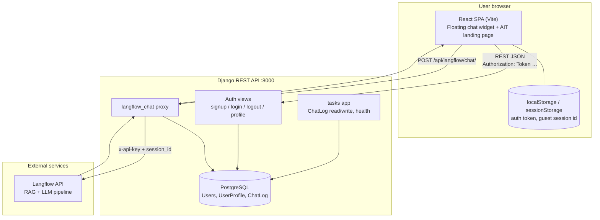
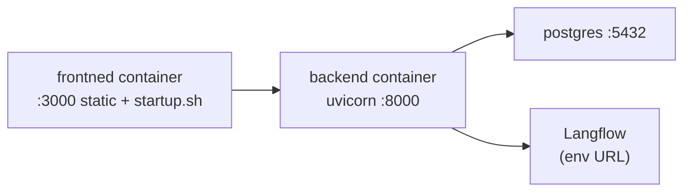
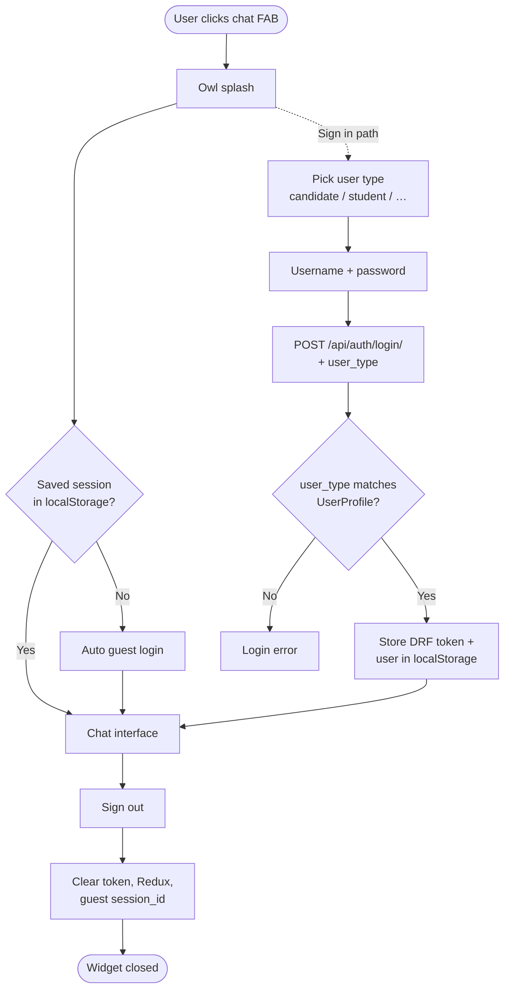
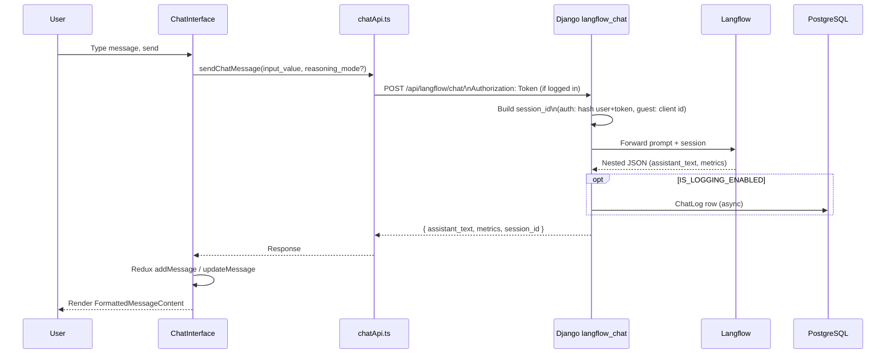

# AITGPT — Rough Deliverables

High-level overview for handoff. Not exhaustive — enough to explain how the system fits together.

**Repo:** https://github.com/AIT-brainlab/AITGPT-APP.git  
**Document generated from workspace:** branch `ag-7-4-setup-devcontainer` (see [Your follow-up tasks](#your-follow-up-tasks) if they need `main` specifically)

---

## 1. Rough system diagram

### Mermaid (paste into GitHub, Notion, or [mermaid.live](https://mermaid.live))



### ASCII (works anywhere — email, slides, Word)

```
┌─────────────────────────────────────────────────────────────┐
│  Browser                                                     │
│  ┌──────────────────┐    ┌─────────────────────────────┐  │
│  │ AITWebsite       │    │ Floating chat widget         │  │
│  │ (landing page)   │    │ App.tsx state machine        │  │
│  └──────────────────┘    │ Redux + chat/auth utils    │  │
│                             └──────────────┬──────────────┘  │
└────────────────────────────────────────────┼────────────────┘
                                             │ HTTPS / REST
                                             ▼
┌─────────────────────────────────────────────────────────────┐
│  Django backend (DRF)                                        │
│  /api/auth/*          login, token, user_type check          │
│  /api/langflow/chat/  proxy to Langflow, parse response      │
│  /api/tasks/*         health, chat log (optional)            │
└──────────────┬──────────────────────────────┬──────────────┘
               │                               │
               ▼                               ▼
        ┌─────────────┐                 ┌─────────────┐
        │ PostgreSQL  │                 │  Langflow   │
        │ users, logs │                 │  AI / RAG   │
        └─────────────┘                 └─────────────┘
```

### Deploy view (Docker, optional second diagram)



---

## 2. Rough logic flow

### 2a. Widget open & authentication



**State machine lives in:** `frontned/src/App.tsx` (`WidgetState`: closed → owl-splash → welcome → user-type-selection → auth-modal → chat).

### 2b. Send chat message (core path)



### 2c. API surface (quick reference)

| Method | Path | Purpose |
|--------|------|---------|
| POST | `/api/auth/login/` | Login; returns token + user |
| POST | `/api/auth/logout/` | Invalidate token |
| GET | `/api/auth/profile/` | Current user |
| POST | `/api/langflow/chat/` | Main chat (auth or guest) |
| GET | `/api/tasks/health/` | Health check |
| GET | `/api/tasks/chat-log/` | Admin chat log export (X-Access-Token) |

---

## 3. Latest main code — where things live

> **Note:** Frontend folder is currently named `frontned/` (typo). README still says `Frontend/`. Align naming before external handoff if needed.

### Repository

| Item | Value |
|------|--------|
| GitHub | https://github.com/AIT-brainlab/AITGPT-APP.git |
| Default branch | `main` |
| Your current branch (when this doc was written) | `ag-7-4-setup-devcontainer` |

### Frontend (`frontned/`)

| File | Role |
|------|------|
| `frontned/src/main.tsx` | App bootstrap, Redux Provider |
| `frontned/src/App.tsx` | Widget state machine, SSO hook |
| `frontned/src/components/FloatingChatWidget.tsx` | Chat shell after login |
| `frontned/src/components/ChatInterface.tsx` | Message list + input |
| `frontned/src/components/FloatingAuthModal.tsx` | Login form |
| `frontned/src/components/FloatingUserTypeSelection.tsx` | Role picker |
| `frontned/src/store/slices/chatSlice.ts` | Messages, reasoning mode |
| `frontned/src/utils/api.ts` | Base URL, `Authorization: Token` |
| `frontned/src/utils/authApi.ts` | login / logout / profile |
| `frontned/src/utils/chatApi.ts` | POST chat to backend |
| `frontned/src/utils/authService.ts` | Guest auth, role helpers |
| `frontned/package.json` | Dependencies (React 18, Vite, Redux) |
| `frontned/docker-compose.yml` | Frontend container |

### Backend (`backend/`)

| File | Role |
|------|------|
| `backend/django_manage.py` | Django CLI entry |
| `backend/src/core/urls.py` | Auth + Langflow routes |
| `backend/src/core/views.py` | `login`, `logout`, `langflow_chat` |
| `backend/src/core/models.py` | `UserProfile` (user_type) |
| `backend/src/core/serializers.py` | Login + Langflow request validation |
| `backend/src/core/settings.py` | DB, CORS, Langflow env vars |
| `backend/src/tasks/urls.py` | Health + chat-log routes |
| `backend/src/tasks/views.py` | Chat logging, health |
| `backend/src/tasks/models.py` | `ChatLog`, `TaskLog` |
| `backend/src/tasks/management/commands/seed_users.py` | Sample users |
| `backend/pyproject.toml` | Python deps (uv) |

### Supporting docs (already in repo)

| File | Role |
|------|------|
| `README.md` | Full architecture + setup |
| `SAMPLE_LOGINS.md` | Test accounts |
| `backend/BACKEND_MIGRATION_STATUS.md` | Backend migration notes |

### Run locally (reminder)

```bash
# Backend
cd backend
# uv / venv per README, then:
uv run django_manage.py runserver 0.0.0.0:8000

# Frontend
cd frontned
npm install
npm run dev
# → http://localhost:3000
```

---

## Your follow-up tasks

Things only you can finish before sending this to whoever asked:

### Must do

- [ ] **Confirm “latest main”** — They may want code on `main`, not your feature branch. Run:
  ```powershell
  git fetch origin
  git checkout main
  git pull origin main
  ```
  If your work is only on `ag-7-4-setup-devcontainer`, either merge to `main` or tell them which branch has the latest code.

- [ ] **Fix or explain `frontned/` typo** — Git shows `frontend/` deleted and `frontned/` added. Either rename back to `frontend/` or add one sentence in the email: “frontend lives in `frontned/` until rename.”

- [ ] **Add repo link + branch name** in the email/Doc you send (copy from table above).

- [ ] **Export format they want** — This file is Markdown. If they want PDF or draw.io:
  - Paste Mermaid blocks into https://mermaid.live → Export PNG/SVG
  - Or copy ASCII diagram into PowerPoint/Google Slides
  - Or import Mermaid into Notion / GitHub wiki

### Nice to have (5–10 min)

- [ ] Screenshot of running app (widget open + one chat reply) — proves it works
- [ ] Note Langflow is **external** (URL in backend `.env`, not in this repo)
- [ ] Attach `SAMPLE_LOGINS.md` or paste 2–3 test logins if they will demo login

### I cannot do for you

- Push to GitHub or open PRs (unless you ask in Agent mode with git write)
- Verify Langflow / production URLs are correct
- Know if they want Thai/English or a specific template (AIT Brainlab slide deck, etc.)
- Guarantee `main` matches your laptop without you pulling/merging

---

## One-paragraph summary (paste into email)

AITGPT is a React floating chat widget on an AIT landing page. Users authenticate by role (or continue as guest), then messages go to a Django API that proxies to Langflow for AI answers and optionally logs turns in PostgreSQL. Main code: `frontned/src/App.tsx` and chat utils on the frontend; `backend/src/core/views.py` (`langflow_chat`) on the backend. Diagrams and flows are in `docs/ROUGH_DELIVERABLES.md` in the repo.
